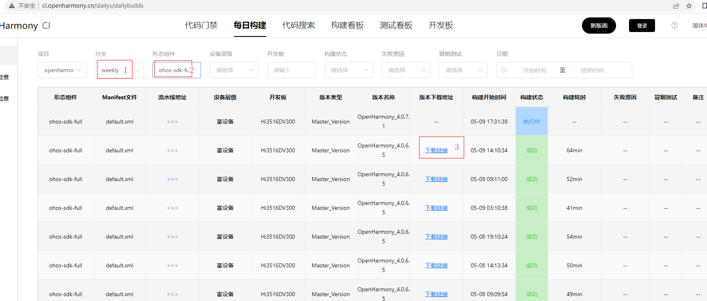
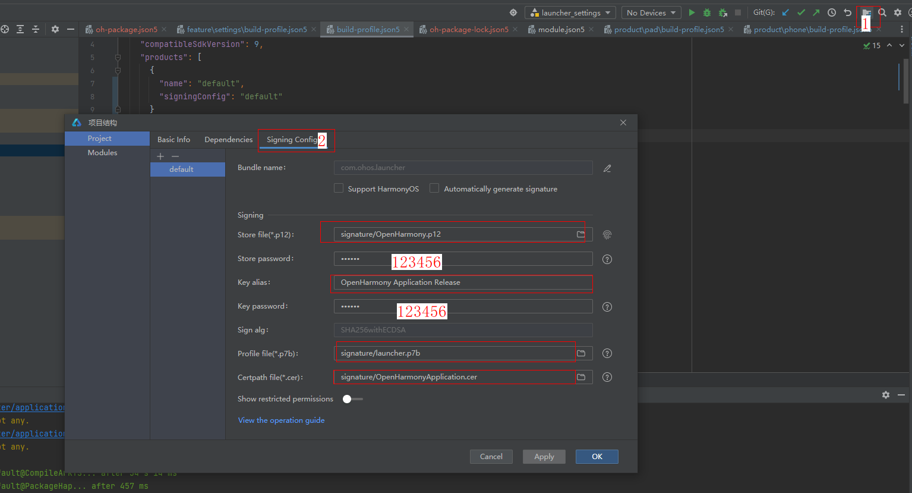
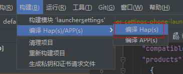

# 应用子系统/Launcher

- [应用子系统/Launcher](#应用子系统launcher)
  - [简介](#简介)
  
  - [目录](#目录)
    - [目录结构](#目录结构)
    
  - [约束](#约束)
  
  - [说明](#说明)
    - [使用说明](#使用说明)
    
  - [开发调试](#开发调试)
  
    - [IDE下载](#IDE下载)
    - [SDK使用说明及下载地址](SDK使用说明及下载地址)
    - [代码下载](#代码下载)
    - [签名配置](#签名配置)
    - [调试编译](#调试编译)
    - [部件更新](#部件更新)
  
  - [相关仓](#相关仓)

## 简介
Launcher 作为系统人机交互的首要入口，提供应用图标的显示、点击启动、卸载应用，并提供桌面布局设置以及最近任务管理等功能。  
Launcher 采用 扩展的TS语言（ArkTS）开发，主要的结构如下：


- **product**
  业务形态层：区分不同产品、不同屏幕的各形态桌面，含有桌面窗口、个性化业务，组件的配置，以及个性化资源包。

- **feature**
  公共特性层：抽象的公共特性组件集合，可以被各桌面形态引用。

- **common**
  公共能力层：基础能力集，每个桌面形态都必须依赖的模块。

## 目录
### 目录结构
```
/applications/standard/launcher/
├── common                    # 公共能力层目录
├── docs                      # 开发指南
├── feature                   # 公共特性层目录
│   └── appcenter             # 应用中心
│   └── bigfolder             # 智能文件夹
│   ├── form                  # 桌面卡片管理功能
│   ├── gesturenavigation     # 手势导航
│   ├── pagedesktop           # 工作区
│   ├── recents               # 最近任务
│   ├── settings              # 桌面设置
│   ├── smartdock             # dock工具栏
├── product                   # 业务形态层目录
├── signature                 # 签名证书
```
## 约束
- 开发环境
    - **DevEco Studio for OpenHarmony**: 版本号大于3.0.0.900，下载安装OpenHarmony SDK API Version 9。（初始的IDE配置可以参考IDE的使用文档）
- 语言版本
    - [ArkTS](https://gitee.com/openharmony/docs/blob/master/zh-cn/application-dev/quick-start/Readme-CN.md)
- 建议
  -  推荐使用本工程下的launcher.p7b文件，路径：signature/launcher.p7b

## 说明
### 使用说明
[使用桌面卡片管理功能调试服务卡片](https://gitee.com/openharmony/applications_launcher/blob/master/docs/%E4%BD%BF%E7%94%A8Launcher%E5%8D%A1%E7%89%87%E7%AE%A1%E7%90%86%E5%8A%9F%E8%83%BD%E8%B0%83%E8%AF%95%E6%9C%8D%E5%8A%A1%E5%8D%A1%E7%89%87.md)

## 开发调试

### IDE下载

下附Windows环境下的链接，其他平台可依据版本号在[harmonyos开发者官网](https://developer.harmonyos.com/cn/develop/deveco-studio/)下载

[DevEco Studio 3.1 Beta2](https://contentcenter-vali-drcn.dbankcdn.cn/pvt_2/DeveloperAlliance_package_901_9/f3/v3/uJyuq3syQ2ak4hE1QZmAug/devecostudio-windows-3.1.0.400.zip?HW-CC-KV=V1&HW-CC-Date=20230408T013335Z&HW-CC-Expire=315360000&HW-CC-Sign=96262721EDC9B34E6F62E66884AB7AE2A94C2A7B8C28D6F7FC891F46EB211A70)，即3.1.0.400版本的IDE（推荐）

[DevEco Studio 3.1 Beta1](https://contentcenter-vali-drcn.dbankcdn.cn/pvt_2/DeveloperAlliance_package_901_9/ad/v3/3dxpYtEeQwGbXPEyOsj8gQ/devecostudio-windows-tool-3.1.0.200.zip?HW-CC-KV=V1&HW-CC-Date=20230215T152758Z&HW-CC-Expire=315360000&HW-CC-Sign=2793048D7B7DCA8FA42FBB5881173029E87E631E967134D9604A219BD3FF4F48)，即3.1.0.200版本的IDE（推荐）

[DevEco Studio 3.0 Beta3 for OpenHarmony](https://contentcenter-vali-drcn.dbankcdn.com/pvt_2/DeveloperAlliance_package_901_9/88/v3/vCRs_VySQy2DoT3T4Ol7NQ/devecostudio-windows-tool-3.0.0.900.zip?HW-CC-KV=V1&HW-CC-Date=20220831T062106Z&HW-CC-Expire=315360000&HW-CC-Sign=9B7F6A8D61523A5108BA418D50050553513DA86A6357360E6080012437FFFB40)，即3.0.0.900版本的IDE（不推荐调试使用，仅推荐配置签名时用）

### SDK使用说明及下载地址

Launcher应用的编译需使用相对应版本的ohos-sdk-full\mac-sdk-full来进行开发调试

IDE上是Public SDK，故full sdk需要重新下载，下载地址：

新版本界面：http://ci.openharmony.cn/workbench/cicd/dailybuild/dailylist

老版本界面：http://ci.openharmony.cn/dailys/dailybuilds

示例：master分支下载此版本即可



下载下来的sdk需要做对应的处理才可正常使用，下载出来文件如图：


示例：

新建文件夹名为`sdk`的目录，在`sdk`下新建名为

[^10]: 当前应用所使用的api版本号是10。api9的版本则需要创建9的文件夹名

的文件夹，将下载出来这几个包解压到**10**的目录下，解压完成后，需要进入到其中两个目录下执行`npm install`，这两个目录分别是：``sdk\10\ets\\build-tools\ets-loader``和``sdk\10\js\build-tools\ace-loader``

### 代码下载

1. git clone https://gitee.com/openharmony/applications_launcher.git
2. 通过下载zip的方式直接下载

### 签名配置

其中OpenHarmony.p12和OpenHarmonyApplication.cer文件可在[签名工具仓](https://gitee.com/openharmony/developtools_hapsigner/tree/master/dist)获取，OpenHarmonyApplication.cer文件是由OpenHarmonyApplication.pem修改后缀获得。launcher.p7b：推荐使用本工程下的launcher.p7b文件，路径：signature/launcher.p7b

如需通过IDE来进行**手工配置签名**，则需先使用3.0.0.900版本的IDE来进行配置（如下图），配置完成后可以使用新版本的IDE进行打开做其他操作。



### 调式编译

注意

**使用[DevEco Studio 3.1 Beta2](https://contentcenter-vali-drcn.dbankcdn.cn/pvt_2/DeveloperAlliance_package_901_9/f3/v3/uJyuq3syQ2ak4hE1QZmAug/devecostudio-windows-3.1.0.400.zip?HW-CC-KV=V1&HW-CC-Date=20230408T013335Z&HW-CC-Expire=315360000&HW-CC-Sign=96262721EDC9B34E6F62E66884AB7AE2A94C2A7B8C28D6F7FC891F46EB211A70)，即3.1.0.400版本的IDE需要注意：**

1. 修改以下对应的文件内容


```
## 以下（feature/settings/build-profile.json5）文件内容修改为
{
  "apiType": 'stageMode',
  "buildOption": {
  },
  "targets": [
    {
      "name": "default",
      "runtimeOS": "OpenHarmony"
    }
  ],
  "entryModules": ["pad-launcher","phone-launcher"]
}
```

```
## 以下（product/pad/build-profile.json5，product/phone/build-profile.json5）两个文件内容修改为
{
  "apiType": 'stageMode',
  "buildOption": {
  },
  "targets": [
    {
      "name": "default",
      "runtimeOS": "OpenHarmony"
    }
  ]
}
```

**使用IDE上方的构建命令进行编译自己本地的代码**




### 部件更新

**使用以下命令来更新编译出来的Launcher部件hap包**

```
ren phone-launcher-default-signed.hap Launcher.hap
ren launcher_settings-phone-launcher-default-signed.hap Launcher_Settings.hap

hdc target mount
hdc shell rm -rf /data/misc_de/0/mdds/0/default/bundle_manager_service
hdc shell rm -rf /data/accounts
hdc shell mount -o remount,rw /
hdc file send .\Launcher.hap /system/app/com.ohos.launcher/Launcher.hap
hdc file send .\Launcher_Settings.hap /system/app/com.ohos.launcher/Launcher_Settings.hap

pause

hdc shell mount -o remount,rw /
hdc shell rm /data/* -rf
hdc shell sync /system/bin/udevadm trigger
hdc shell reboot
```


## 相关仓

- [applications_hap](https://gitee.com/openharmony/applications_hap)
- [applications_systemui](https://gitee.com/openharmony/applications_systemui)
- [aafwk_standard](https://gitee.com/openharmony/aafwk_standard)
- [interface_sdk-js](https://gitee.com/openharmony/interface_sdk-js)
- [developtools_hapsigner](https://gitee.com/openharmony/developtools_hapsigner)